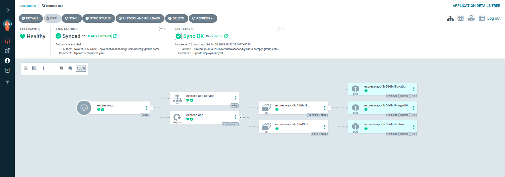

# CI/CD Pipeline for Express.js Application


## Overview

This project implements a **CI/CD pipeline** to build, containerize, and deploy a simple **Express.js "Hello World"  application** to a kubernetes cluster.
The pipeline automates:

- Code checkout from Git
- Docker image build and push to a container registry (Docker Hub)
- Deployment to a Kubernetes cluster

## **Tools and Technologies Used**

- **Node.js & Express** – Backend application
- **Docker** – Containerization
- **CI/CD Tool** – *Jenkins*
- **Container Registry** – Docker Hub
- **Kubernetes / Docker Compose** – Kind cluster
- **Docker-compose** – for local setup 
- **Git/Github** – To store the code
- **Argocd,Argocd image updater** – CD tool

# Note:
  Make sure to install the above mentioned tools/applications.The installation guide is present in **Installation** directory.

# Assumptions:
1.EKS/kubernetes/Kind cluster is healthy and ready to deploy with the necessary permissions.

2.Please install the argocd for Continuous deployment process

3.Make sure to install Argocd image updater in the same cluster

4.Just to keep the project structure easy I have kept the Dockerfile and docker-compose.yml in the code repository as well as th pipeline repository.

# **How to Run Locally**
## **Docker-compose**
- Pull the express repo and use 

- Used Docker Compose for local testing to easily manage and run multi-container setups in a reproducible environment.

- Simplified the development workflow by isolating dependencies and services through containerization.

- Enabled quick iteration and testing of application code without manual environment configuration.

```
Commands:

git clone https://github.com/naveenankasadaddi/express.git
cd examples/hello-world
docker-compose up

```

## **Credentials:**
- configure the Credentials for the pipeline
```
docker-cred → Docker Hub username/password

sonarqube → SonarQube token

github → GitHub personal access token (PAT)
```
# Note:
- Just to make the running process smooth I have kept Dockerfile and compose file in both source code repo and manisfest repo.

# **Working Principle:**
This Jenkins pipeline is triggered automatically via a GitHub webhook whenever code is pushed to the repository. It starts by cloning the source code from the GitHub master branch and installing necessary dependencies using npm. It then proceeds to install Jest for testing, although the test execution is missing and should ideally include a npx jest or npm test command. Next, it performs static code analysis using SonarQube by running sonar-scanner and authenticating with a token. ESLint is also installed for linting, but the actual lint execution is currently commented out and should be enabled for proper code quality checks. Once the code quality stages are complete, the pipeline builds a Docker image tagged with the current date, runs a Trivy scan for vulnerabilities, and pushes the image to Docker Hub using stored credentials. After successfully pushing the image, it updates the Kubernetes deployment manifest in a separate GitHub repository by replacing a placeholder with the new image tag, committing the changes, and pushing them back using a GitHub token—although a typo in the branch name (maain instead of main) should be corrected. Finally, regardless of the build outcome, an email notification is sent summarizing the job details. This pipeline ensures automated testing, code quality checks, security scanning, containerization, and deployment manifest updates as part of a robust CI/CD process.


```
# Sample Visual Reference
                                                        +--------------------------+
                                                        |     GitHub Trigger      |
                                                        | githubPush on PR/Merge  |
                                                        +-----------+--------------+
                                                                    |
                                                                    v
                                                        +--------------------------+
                                                        |   clone-source-code      |
                                                        | Git Checkout from GitHub|
                                                        +--------------------------+
                                                                    |
                                                                    v
                                                        +--------------------------+
                                                        | Install-dependencies     |
                                                        | npm install              |
                                                        +--------------------------+
                                                                    |
                                                                    v
                                                        +--------------------------+
                                                        |      Run Tests           |
                                                        | Unit Tests using Jest    |
                                                        +--------------------------+
                                                                    |
                                                                    v
                                                        +--------------------------+
                                                        |  Static Code Analysis    |
                                                        | SonarQube                |
                                                        +--------------------------+
                                                                    |
                                                                    v
                                                        +--------------------------+
                                                        |       Lint Code          |
                                                        | ESLint                   |
                                                        +--------------------------+
                                                                    |
                                                                    v
                                                        +------------------------------+
                                                        |   Build & Push Docker Image  |
                                                        | docker build, trivy scan     |
                                                        | docker push to Docker Hub    |
                                                        +------------------------------+
                                                                    |
                                                                    v
                                                        +------------------------------------+
                                                        |  Update K8s Manifest in GitHub     |
                                                        | sed image tag -> git push ops repo|
                                                        +------------------------------------+
                                                                    |
                                                                    v
                                                        +--------------------------+
                                                        |    Email Notification    |
                                                        |  Build status via email  |
                                                        +--------------------------+
```

This Jenkins pipeline is designed to automate the CI/CD workflow for a Node.js-based Dockerized application. It begins with a githubPush() trigger that automatically starts the pipeline when changes are pushed to the repository. The pipeline defines environment variables, including Docker image tags, registry credentials, and metadata required across stages.

### **Stage-1: clone-source-code:**
- This stage clones the source code from the specified GitHub repository and branch, ensuring the latest application code is available for the pipeline. It forms the foundation for all subsequent operations.

### **Stage-2: Install-dependiences:**
-  The pipeline navigates to the examples/hello-world directory and installs all required Node.js dependencies using npm install. This is crucial to ensure all libraries and modules are available for testing and building.

### **Stage-3: Test on PR:**
- This stage is conditional and runs only on pull requests (changeRequest()), executing the run_tests.sh script to perform automated tests. It also archives JUnit XML test results to provide insights in the Jenkins UI.

### **Stage-3: Static Code Analysis:**
- Here, SonarQube is used to perform static code analysis on the codebase to identify bugs, code smells, and security issues. It authenticates using a stored token and runs sonar-scanner with appropriate configuration parameters.

### **Stage-4: Lint Code:**
- The pipeline installs ESLint and runs linting to enforce coding standards and detect issues such as syntax errors or bad practices. The step allows the build to proceed even if lint errors exist (|| true).

### **Stage-5: Build Docker Image:**
- This stage authenticates with Docker Hub using Jenkins credentials and builds a Docker image using the current codebase. It tags the image with a version and pushes it to the specified Docker registry.

### **Stage-6: Vulnerability Scan:**
- Using Trivy, this step scans the Docker image for high and critical vulnerabilities. It runs only when the pipeline is triggered from the main branch and fails the build if severe issues are found.

### **Stage-7: Docker push:**
- Ensures the Docker image is pushed again to the registry. This stage might seem redundant since the image was pushed earlier, but can act as an explicit safety net or retry mechanism.

### **Stage-8: Update manifests file in stage repo:** 
- This stage updates the Kubernetes deployment manifest in the staging GitHub repository by replacing the image tag with the current build version. It commits and pushes these changes to the main branch of the staging manifests repo.

### **Stage-9: Manual Approval for Prod repo:
- This stage introduces a manual checkpoint requiring human intervention to approve deployment to production. It acts as a gate to prevent unintentional deployments.

### **Stage-10: Update manifests file in Prod repo:**
- Similar to the staging update, this step updates the Kubernetes deployment manifest in the production repo with the latest Docker image version and pushes the changes.

## **Email Notifications:**
- The post block defines email notifications for both failure and success cases using the emailext plugin. If any stage fails, an email with job name, build number, status, and build URL is sent. Similarly, on successful completion, a notification is sent to inform about the build's success. This ensures continuous communication and transparency during the CI/CD process.

## complete code for pipeline:
```
pipeline {
    agent any
    triggers {
        githubPush() 
    }
    options {
    skipDefaultCheckout()
    timestamps()
    }
    environment {
        DOCKER_REGISTRY = "naveen333a/express-app"
        IMAGE_NAME = "hello-app"
        IMAGE_VERSION = sh(script: 'date +%Y.%m.%d', returnStdout: true).trim()
        //IMAGE_VERSION = "2025.7.8"
        //IMAGE_TAG = "${DOCKER_USER}/${IMAGE_NAME}:V${IMAGE_VERSION}"
        CONTAINER_NAME=  "${DOCKER_REGISTRY}:V${IMAGE_VERSION}"
        REGISTRY_CREDENTIALS = credentials('docker-cred')
    }
    stages {
        stage('clone-source-code') {
            steps {
                git url:'https://github.com/naveenankasadaddi/express.git',branch : 'master'
            }
        }
        stage('Install-dependiences'){
            steps{
                sh '''
                    cd examples/hello-world
                    npm install
                '''
            }
        }
        stage('Test on PR') {
            when {
                changeRequest()
            }
            steps {
                sh './run_tests.sh'
                junit 'reports/**/*.xml'
            }
        }
        stage('Static Code Analysis') {
            environment {
                SONAR_URL = "http://localhost:9000"
            }
            steps {
                withCredentials([string(credentialsId: 'sonarqube', variable: 'SONAR_AUTH_TOKEN')]) {
                sh '''
                    npm install -g sonar-scanner
                    sonar-scanner -Dsonar.projectKey=express-app -Dsonar.sources=. -Dsonar.exclusions=**/node_modules/** -Dsonar.host.url=${SONAR_URL} -Dsonar.login=$SONAR_AUTH_TOKEN
                '''
                }
            }
        }

        stage('Lint Code') {
            steps {
                sh '''
                    cd examples/hello-world
                    npm install --save-dev eslint
                    npm run lint || true
                '''
            }
        }
    stage('Build Docker Image') {
      steps {
        script {
            withCredentials([usernamePassword(credentialsId: 'docker-cred', usernameVariable: 'DOCKER_USER', passwordVariable: 'DOCKER_PASS')]) {
                sh '''
                    cd examples/hello-world
                    echo "Building Docker image $CONTAINER_NAME"
                    docker build -t "$CONTAINER_NAME" .


                    echo "Logging into Docker Hub"
                    docker login -u "$DOCKER_USER" -p "$DOCKER_PASS"

                    echo "Pushing image to Docker Hub"
                    docker push $CONTAINER_NAME
                '''
            }
        }
    }
    stage('Vulnerability Scan'){
        when{
            branch 'main'
        }
        steps{
            sh '''
                echo "Running Trivy vulnerability scan on $CONTAINER_NAME"
                trivy image --severity CRITICAL,HIGH --exit-code 1 "$CONTAINER_NAME"

            '''
        }
    }
    stage('Docker push'){
        steps {
            script {
                withCredentials([usernamePassword(credentialsId: 'docker-cred', usernameVariable: 'DOCKER_USER', passwordVariable: 'DOCKER_PASS')]) {
                    sh '''
                    echo "Logging into Docker Hub"
                    docker login -u "$DOCKER_USER" -p "$DOCKER_PASS"

                    echo "Pushing image to Docker Hub"
                    docker push $CONTAINER_NAME
                '''
            }
        }

    }
    stage('Update manifests file in stage repo') {
        environment {
            GIT_REPO_NAME = "Stage-manifests"
            GIT_USER_NAME = "naveenankasadaddi"
        }
        steps {
            withCredentials([string(credentialsId: 'github-stage', variable: 'GITHUB_TOKEN')]) {
                sh '''
                    git config user.email "<email>"
                    git config user.name "<username>"
                    BUILD_NUMBER=${BUILD_NUMBER}
                    sed -i "s/replaceImageTag/${IMAGE_VERSION}/g" vananam-project/k8s-manifests/deployment.yml
                    git add vananam-project/k8s-manifests/deployment.yml
                    git commit -m "Update deployment image to version ${IMAGE_VERSION}"
                    git push https://${GITHUB_TOKEN}@github.com/${GIT_USER_NAME}/${GIT_REPO_NAME} HEAD:main
                '''
            }
        }
    }
    stage('Manual Approval for Prod repo') {
      steps {
        input message: 'Deploy to production?', ok: 'Deploy'
      }
    }

    stage('Update manifests file in Prod repo') {
        environment {
            GIT_REPO_NAME = "Prod-manifests"
            GIT_USER_NAME = "naveenankasadaddi"
        }
        steps {
            withCredentials([string(credentialsId: 'github-prod', variable: 'GITHUB_TOKEN')]) {
                sh '''
                    git config user.email "<email>"
                    git config user.name "<username>"
                    BUILD_NUMBER=${BUILD_NUMBER}
                    sed -i "s/replaceImageTag/${IMAGE_VERSION}/g" vananam-project/k8s-manifests/deployment.yml
                    git add vananam-project/k8s-manifests/deployment.yml
                    git commit -m "Update deployment image to version ${IMAGE_VERSION}"
                    git push https://${GITHUB_TOKEN}@github.com/${GIT_USER_NAME}/${GIT_REPO_NAME} HEAD:main
                '''
            }
        }
    }

}
  }
    post {
        failure {
            emailext (
                subject: "Build failure: ${env.JOB_NAME} - #${env.BUILD_NUMBER}",
                body: """
                Job Name: ${env.JOB_NAME}
                Build Number: ${env.BUILD_NUMBER}
                Build Status: ${currentBuild.currentResult}
                Build URL: ${env.BUILD_URL}
                """,
                to: 'naveenank2001@gmail.com'
            )
        }
        success {
            emailext (
                subject: "Build success: ${env.JOB_NAME} - #${env.BUILD_NUMBER}",
                body: """
                Job Name: ${env.JOB_NAME}
                Build Number: ${env.BUILD_NUMBER}
                Build Status: ${currentBuild.currentResult}
                Build URL: ${env.BUILD_URL}
                """,
                to: 'naveenank2001@gmail.com'
            )
        }
    }
}

```

### **Without Docker**

```bash
npm install
node index.js
```


# Continous Deploymentimplementation:
- For continuous deployment i'am using Arrgocd.
- Once the Argoc is Up and running  in the kubernetes cluster,deploy the express kustomize in the Argo cd by providing the cenecessary informations for the Argocd.
- I'am deploying the application in the kind cluster in a nodeport to access the UI.
- You can you Eks cluster and  and change the service to LOadbalancer mode if you want to deploy in cloud environments.For your refferenc I have attached the how to use AWS ALB you can reffer.


Note:
- Please make sure to configure the kubernetes cluster.
- Install the Argocd in the same cluster using the documentationin this repo.
- Please follow the following steps to deploy the manifests in kubernetes cluster using Argocd


```
  Steps to deploy kustomize/helm in  Argocd
1.Login to Argocd UI.
2.Click on NewApp and provide necessary information like,
Application name,Project name,Sync Policy as Automatic,Prune Propagation Policy: Replace and Retry,and add git information to fetch. and click on create.
3.Once the application is deployed it looks like this.

```


