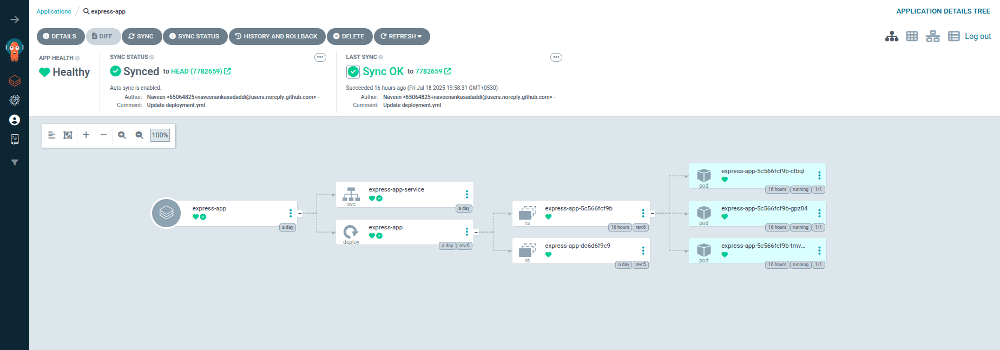

# CI/CD Pipeline for Express.js Application


## Overview

This project implements a **CI/CD pipeline** to build, containerize, and deploy a simple **Express.js "Hello World"  application** to a kubernetes cluster.
The pipeline automates:

- Code checkout from Git
- Docker image build and push to a container registry (Docker Hub)
- Deployment to a Kubernetes cluster

## **Tools and Technologies Used**

- **Node.js & Express** – Backend application
- **Docker** – Containerization
- **CI/CD Tool** – *Jenkins*
- **Container Registry** – Docker Hub
- **Kubernetes / Docker Compose** – Kind cluster
- **Docker-compose** – for local setup 
- **Git/Github** – To store the code
- **Argocd,Argocd image updater** – CD tool

# Note:
  Make sure to install the above mentioned tools/applications.The installation guide is present in **Installation** directory.

# Assumptions:
1.EKS/kubernetes/Kind cluster is healthy and ready to deploy with the necessary permissions.
2.Please install the argocd for Continuous deployment process
3.Make sure to install Argocd image updater in the same cluster
4.Just to keep the project structure easy I have kept the Dockerfile and docker-compose.yml in the code repository as well as th pipeline repository.

# **How to Run Locally**
## **Docker-compose**
- Pull the express repo and use 

- Used Docker Compose for local testing to easily manage and run multi-container setups in a reproducible environment.

- Simplified the development workflow by isolating dependencies and services through containerization.

- Enabled quick iteration and testing of application code without manual environment configuration.

```
Commands:

git clone https://github.com/naveenankasadaddi/express.git
cd examples/hello-world
docker-compose up

```
# Note:
- Just to make the running process smooth I have kept Dockerfile and compose file in both source code repo and manisfest repo.

# **Working Principle:**
This Jenkins pipeline implements a complete CI/CD process for a Node.js (Express.js) application integrated with Docker and GitOps. The pipeline is automatically triggered by GitHub webhooks on every push to the master branch. It starts by cloning the source code from GitHub and installing project dependencies using npm install. Although Jest is installed for testing, actual test execution is not performed in the current setup. The pipeline then performs static code analysis using SonarQube and installs ESLint for linting, though the lint execution is commented out. After code quality checks, it builds a Docker image, tags it with the current date, and performs a vulnerability scan using Trivy to detect CRITICAL or HIGH severity issues before pushing the image to Docker Hub. Following the image build, the pipeline updates the Kubernetes deployment manifest in an operations repository by replacing the placeholder image tag with the new version. This enables a GitOps workflow where Argo CD can automatically pick up the changes and deploy the new image to the Kubernetes cluster. Finally, the pipeline sends an email notification with the build status, job name, and build URL to notify the developer of the outcome.


```
# Sample Visual Reference
                                                Developer Push (GitHub)
                                                        │
                                                        ▼
                                                    Jenkins Pipeline
                                                  ┌───────────────┐
                                                  │ Build & Test  │
                                                  │ SonarQube     │
                                                  │ ESLint        │
                                                  │ Docker Build  │
                                                  │ Trivy Scan    │
                                                  └───────────────┘
                                                        │
                                                        ▼
                                                Push Docker Image (Docker Hub)
                                                        │
                                                        ▼
                                                Update K8s Manifest (Ops Repo)
                                                        │
                                                        ▼
                                                  Argo CD Auto Sync
                                                        │
                                                        ▼
                                                Kubernetes Deployment

```


## **CI/CD Pipeline Stages**

### Source Code Management:
- Integrated GitHub Webhooks to trigger Jenkins jobs on every push to the master branch.
- Automated source code checkout using Jenkins declarative pipeline.

### Dependency Management:
- Automated installation of Node.js dependencies via npm install in the pipeline.

### Testing & Quality Assurance:
- Configured Jest for unit testing.
- Integrated SonarQube for static code analysis and security checks.
- Configured ESLint for code linting to ensure adherence to coding standards.

### Containerization & Image Management:
- Created Docker images using Dockerfile.
- Tagged images dynamically using date-based versioning 
- Managed Docker Hub integration for image push and pull with secure credential handling in Jenkins.

### Security & Vulnerability Scanning:
Integrated Trivy (optional to mention if used) for scanning Docker images and application code for vulnerabilities before deployment.

### Notifications & Reporting:
Configured Email Notifications to report pipeline status (Success/Failure) with build details automatically.


## complete code for pipeline:
```
pipeline {
    agent any
    triggers {
        githubPush() 
    }
    environment {
        DOCKER_REGISTRY = "naveen333a/express-app"
        IMAGE_NAME = "hello-app"
        IMAGE_VERSION = sh(script: 'date +%Y.%m.%d', returnStdout: true).trim()
        //IMAGE_VERSION = "2025.7.8"
        //IMAGE_TAG = "${DOCKER_USER}/${IMAGE_NAME}:V${IMAGE_VERSION}"
        CONTAINER_NAME=  "${DOCKER_REGISTRY}:V${IMAGE_VERSION}"
        REGISTRY_CREDENTIALS = credentials('docker-cred')
    }
    stages {
        stage('clone-source-code') {
            steps {
                git url:'https://github.com/naveenankasadaddi/express.git',branch : 'master'
            }
        }
        stage('Install-dependiences'){
            steps{
                sh '''
                    cd examples/hello-world
                    npm install
                '''
            }
        }
        stage('Run Tests') {
            steps {
                sh '''
                    cd examples/hello-world
                    npm install --save-dev jest
                '''
            }
        }
        stage('Static Code Analysis') {
            environment {
                SONAR_URL = "http://localhost:9000"
            }
            steps {
                withCredentials([string(credentialsId: 'sonarqube', variable: 'SONAR_AUTH_TOKEN')]) {
                sh '''
                    npm install -g sonar-scanner
                    sonar-scanner -Dsonar.projectKey=express-app -Dsonar.sources=. -Dsonar.exclusions=**/node_modules/** -Dsonar.host.url=${SONAR_URL} -Dsonar.login=$SONAR_AUTH_TOKEN
                '''
                }
            }
        }

        stage('Lint Code') {
            steps {
                sh '''
                    cd examples/hello-world
                    npm install --save-dev eslint
                    //npm run lint || true
                '''
            }
        }
    stage('Build and Push Docker Image') {
      steps {
        script {
            withCredentials([usernamePassword(credentialsId: 'docker-cred', usernameVariable: 'DOCKER_USER', passwordVariable: 'DOCKER_PASS')]) {
                sh '''
                    cd examples/hello-world
                    echo "Building Docker image $CONTAINER_NAME"
                    docker build -t "$CONTAINER_NAME" .

                    echo "Running Trivy vulnerability scan on $CONTAINER_NAME"
                    trivy image --severity CRITICAL,HIGH --exit-code 1 "$CONTAINER_NAME"

                    echo "Logging into Docker Hub"
                    docker login -u "$DOCKER_USER" -p "$DOCKER_PASS"

                    echo "Pushing image to Docker Hub"
                    docker push $CONTAINER_NAME
                '''
            }
        }
    }
    stage('Update manifests file in ops repo') {
        environment {
            GIT_REPO_NAME = "Projects"
            GIT_USER_NAME = "naveenankasadaddi"
        }
        steps {
            withCredentials([string(credentialsId: 'github', variable: 'GITHUB_TOKEN')]) {
                sh '''
                    git config user.email "naveenank2001@gmail.com"
                    git config user.name "naveenankasadaddi"
                    BUILD_NUMBER=${BUILD_NUMBER}
                    sed -i "s/replaceImageTag/${IMAGE_VERSION}/g" vananam-project/k8s-manifests/deployment.yml
                    git add vananam-project/k8s-manifests/deployment.yml
                    git commit -m "Update deployment image to version ${IMAGE_VERSION}"
                    git push https://${GITHUB_TOKEN}@github.com/${GIT_USER_NAME}/${GIT_REPO_NAME} HEAD:maain
                '''
            }
        }
    }

}
  }
    post {
        always {
            emailext (
                subject: "Build Notification: ${env.JOB_NAME} - #${env.BUILD_NUMBER}",
                body: """
                Job Name: ${env.JOB_NAME}
                Build Number: ${env.BUILD_NUMBER}
                Build Status: ${currentBuild.currentResult}
                Build URL: ${env.BUILD_URL}
                """,
                to: 'naveenank2001@gmail.com'
            )
        }
    }
}


```

### **Without Docker**

```bash
npm install
node index.js
```

# Continous Deploymentimplementation:
- For continuous deployment i'am using Arrgocd.
- Once the Argoc is Up and running  in the kubernetes cluster,deploy the express kustomize in the Argo cd by providing the cenecessary informations for the Argocd.
- I'am deploying the application in the kind cluster in a nodeport to access the UI.
- You can you Eks cluster and  and change the service to LOadbalancer mode if you want to deploy in cloud environments.For your refferenc I have attached the how to use AWS ALB you can reffer.

```
  Steps to deploy kustomize/helm in  Argocd
1.Login to Argocd UI.
2.Click on NewApp and provide necessary information like,
Application name,Project name,Sync Policy as Automatic,Prune Propagation Policy: Replace and Retry,and add git information to fetch. and click on create.
3.Once the application is deployed it looks like this.

```



```
Note:
- Please make sure to configure the kubernetes cluster.
- Install the Argocd in the same cluster using the documentationin this repo.
```